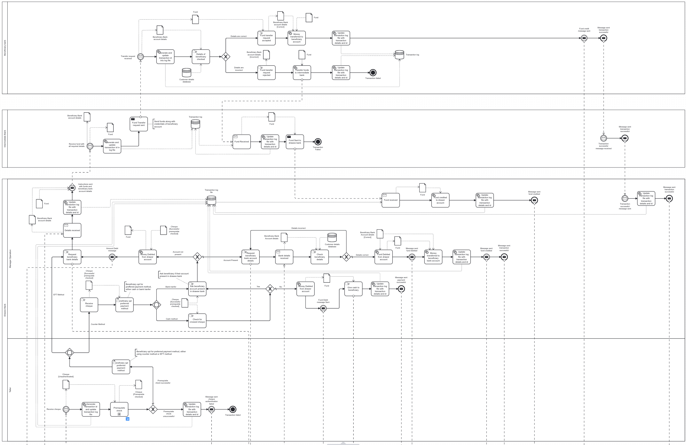
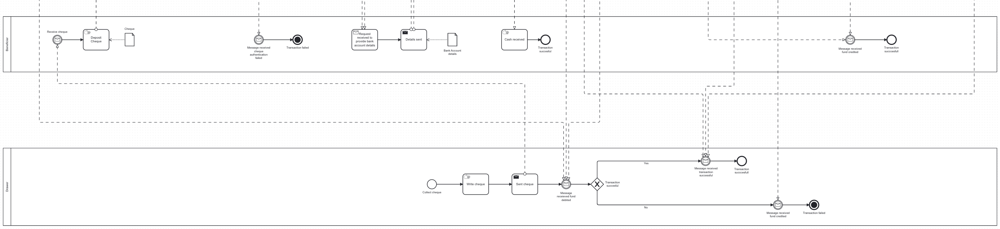
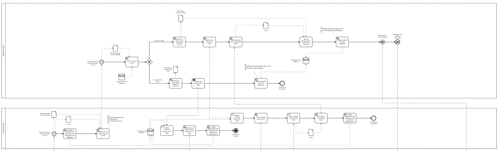
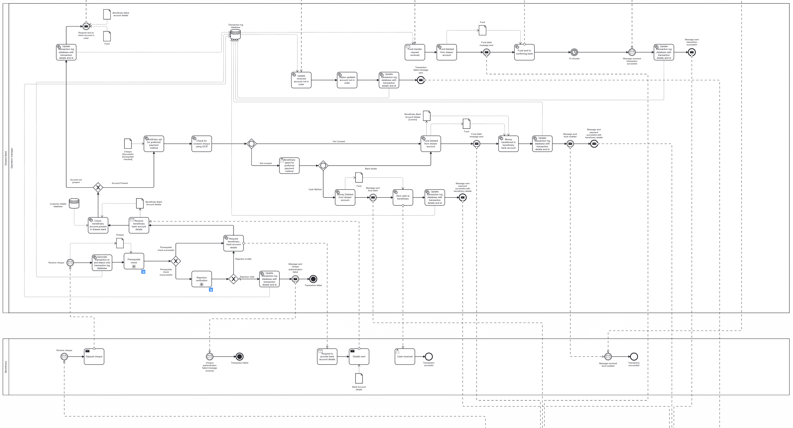
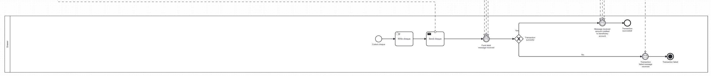

# About this Project
In this project, I have created two simple BPNM diagrams which show how the `current cheque processing system works` and `how it can be changed after implementing automation`. I also have added a small code to simulate the process of cheque processing.

# Requirements to view the BPNM diagram
To view the BPNM diagram, you need to have [Camunda Modeler](https://camunda.com/) installed in your system.

# How the BPNM diagram look
1. As is BPNM diagram
   
   

2. As is BPNM diagram
   
   
   

# To view the BPMN diagram
  * Open the Camunda Modeler
  * Navigate to the folder named `BPNM Diagrams`
  * Open both the files `as_is.bpmn` and `to_be.bpnm`
  * You can view the diagram

# Requirements to run the code
To execute the code you need the following software installed in your system:
   * [Python](https://www.python.org/downloads/)
   * [Anaconda Navigator](https://www.anaconda.com/products/distribution)
   * [Juypyter notebook](https://jupyter.org/install)
   * [PostgreSQL](https://www.postgresql.org)
   * [PgAdmin](https://www.pgadmin.org)

# To execute the code
At first set up your postgresql then you would be able to execute the execute the code.
Next follow the steps below:
  * Open the jupyter notebook
  * Open the file `Cheque Processing System.ipynb`
  * Change the configuration of the database according to your system.
  * Run the cells

# Output
After running the code the following will be the output:
  * Create a database named `cheque_processing_system`
  * Create two table named `Drawee_bank` and `Beneficiary_bank`in the database, which will have the name, account number and the amount of balance present in their account.
  * Insert the data into the table
  * Fetch the data from the table
  * Update the data in the table
  * Delete the data from the table

Thus simulating the cheque processing system.